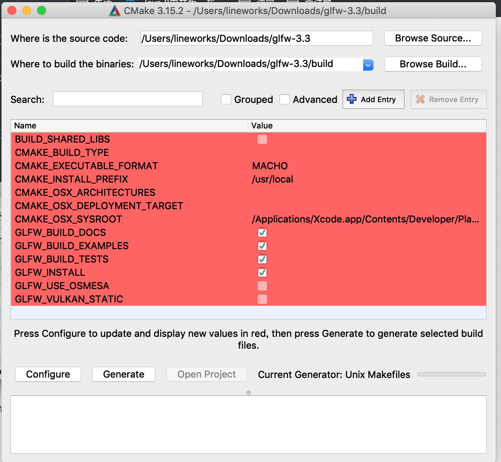
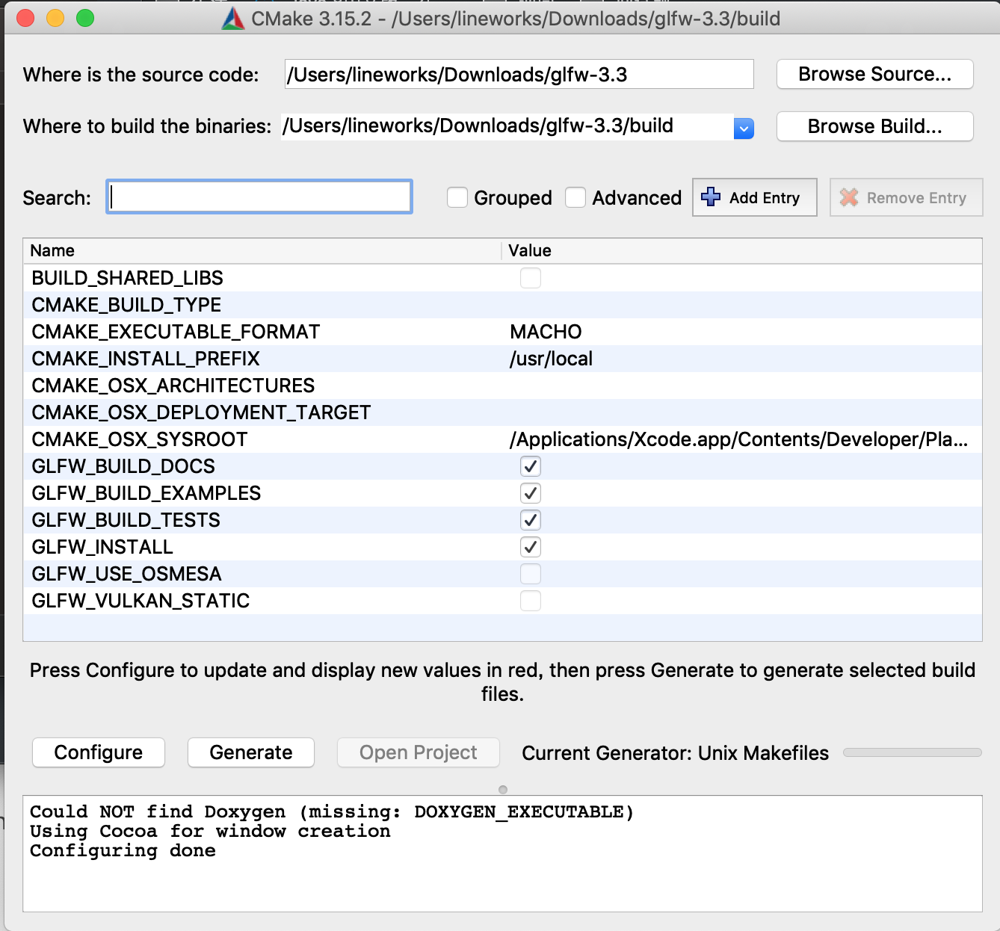
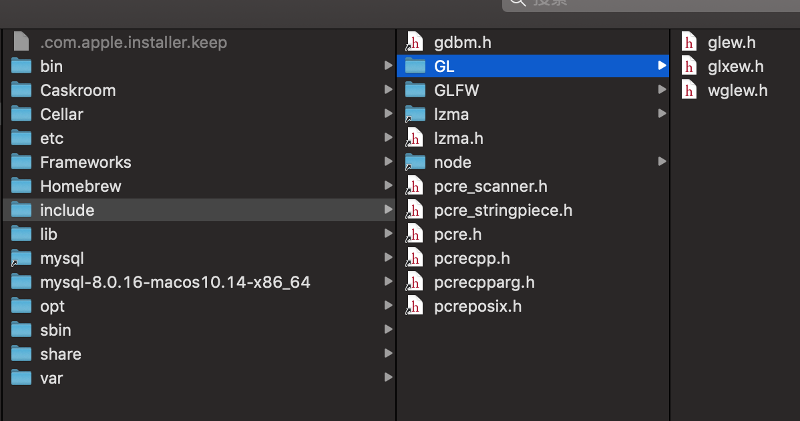
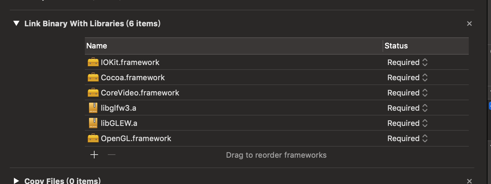
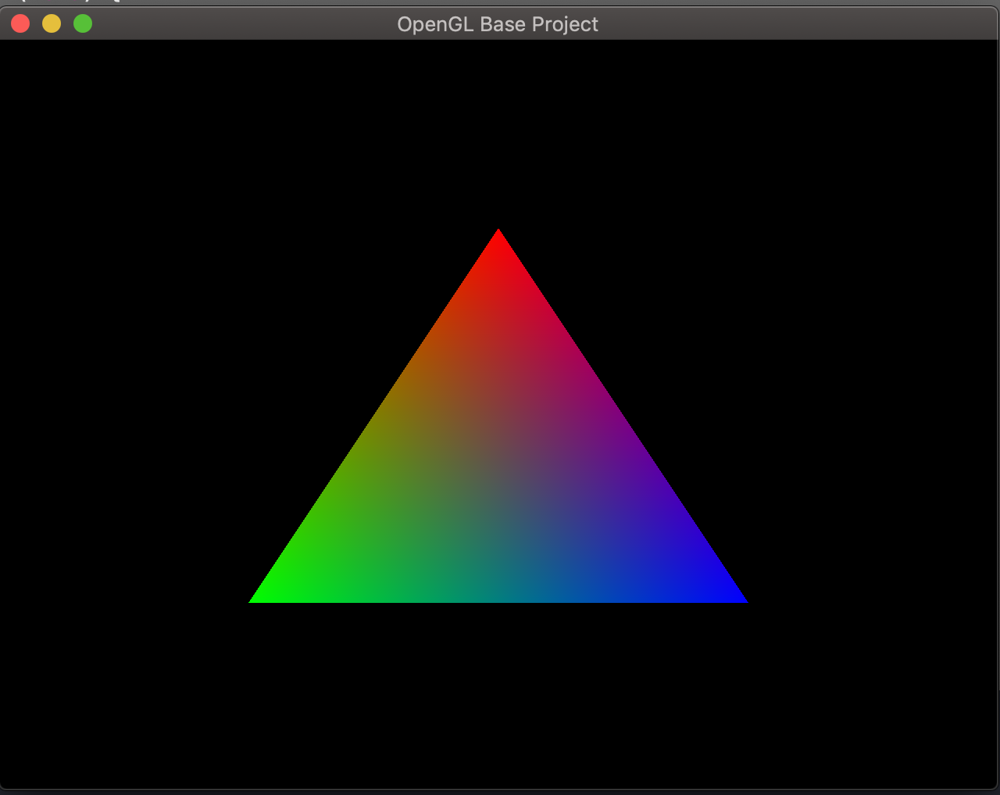

# MAC OPEN GL 环境搭建

## 基础库介绍

先要安装两个库一个是GLEW（OpenGL Extension Wrangler Library），另外一个是GLFW（Graphics Library Framework）

### GLEW 

譯自英文-OpenGL擴展Wrangler庫是一個跨平台的C / C ++庫，可幫助查詢和加載OpenGL擴展。 GLEW提供了高效的運行時機制，用於確定目標平台上支持哪些OpenGL擴展。所有OpenGL擴展都在一個頭文件中公開，該文件是從官方擴展名列表機器生成的

### GLFW

GLFW 是配合 OpenGL 使用的轻量级工具程序库，缩写自 Graphics Library Framework（图形库框架）。GLFW 的主要功能是创建并管理窗口和 OpenGL 上下文，同时还提供了处理手柄、键盘、鼠标输入的功能。

## 进入安装步骤

### 准备工作

要进行安装的话需要先安装CMake，可以选择使用GUI 方式 或者命令行的方式。GUI可以在这里[下载](https://cmake.org/download/)，命令行的方式的话，可以用brew来安装，方式如下

```shell
brew install cmake
```

### 安装GLEW

首先在这里下载[源码](http://glew.sourceforge.net/)，下载以后，解压文件，然后进入到文件所在路径，打开终端进入到此路径，执行命令

```shell
sudo make install
```

### 安装GLFW

首先在[这里](https://www.glfw.org/download.html)下载源码，我们可以选择直接下载编译好的库，也可以下载源文件然后通过camke来自己编译，区别是如果用cmake库的话，在执行成功以后，会直接将生成的库与头文件分别添加到系统路径，也就是/usr/local/include和/usr/local/lib。这里就自己选择方式了。我在这里介绍利用make工具，自己编译的方式

打开cmake 的gui工具，在source code选择下载的glfw路径，这一步需要在这个路径创建一个build目录，用于存放生成的文件。然后在browse build路径选择我们刚才创建的路径，点击configure。

如果出现了红色的选项，继续点击configura，消除红色的为止，最后点击generate。生成成功会出现如下效果



接下来从终端进入到build目录，没错就是刚才我们创建的build，输入如下指令

```shell
sudo make
sudo make install
```

执行成功后，剩成的.a文件与头文件就都放到/usr/local/include和/usr/local/lib了。

环境安装好以后，应该是这个样子的



至此，环境安装完毕，接下来就是加入到工程了

## 加入工程

### 配置搜索路径

首先我们创建一个command line的工程，然后在build setting里这只user search path，在user search path中设置为：/usr/local/include，这里一定要注意不能选择递归查找，否则会出错。然后设置library search path为：/usr/local/lib。设置这个的作用是工程中明确工程中查找头文件和.a文件的路径。

### 添加要链接的framework

添加以下库文件：

- Cocoa.framework
- OpenGL.framwork
- GLUT.framework
- CoreVideo.framework
- IOKit.framework
- libglfw3.a
- libGLEW.a



其中，libglfw3.a、libGLEW.a需要点击 add another，然后进入要路径/usr/local/lib中添加。

配置完成以后，就可以写代码了，进入main.cpp文件，将main中修改如下

```c++
#include <iostream>
#include <GL/glew.h>
#include <GLFW/glfw3.h>
void Render(void)
{
    glClearColor(0.0f, 0.0f, 0.0f, 1.0f);
    glClear(GL_COLOR_BUFFER_BIT);
    glBegin(GL_TRIANGLES);
    {
        glColor3f(1.0,0.0,0.0);
        glVertex2f(0, .5);
        glColor3f(0.0,1.0,0.0);
        glVertex2f(-.5,-.5);
        glColor3f(0.0, 0.0, 1.0);
        glVertex2f(.5, -.5);
    }
    glEnd();
}
int main(void) {
    GLFWwindow* win;
    if(!glfwInit()){
        return -1;
    }
    win = glfwCreateWindow(640, 480, "OpenGL Base Project", NULL, NULL);
    if(!win)
    {
        glfwTerminate();
        exit(EXIT_FAILURE);
    }
    if(!glewInit())
    {
        return -1;
    }
    glfwMakeContextCurrent(win);
    while(!glfwWindowShouldClose(win)){
        Render();
        glfwSwapBuffers(win);
        glfwPollEvents();
    }
    glfwTerminate();
    exit(EXIT_SUCCESS);
    return 0;
}
```

见证奇迹的时刻到了，运行，你将会看到一个漂亮的三角形

mac 工程搭建，就说这么多了。

---

感谢以下文章的作者：

[Mac系统下配置OpenGL环境（小白自学版）](https://zhuanlan.zhihu.com/p/24529016)

[OpenGL学习笔记（二）—— (macOS)环境搭建](http://blog.shenyuanluo.com/OpenGLEnvironment.html)

